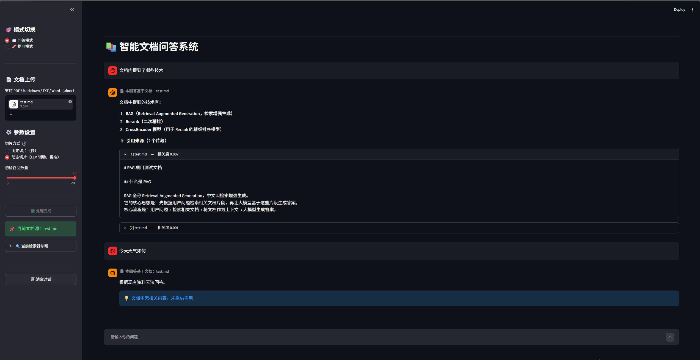
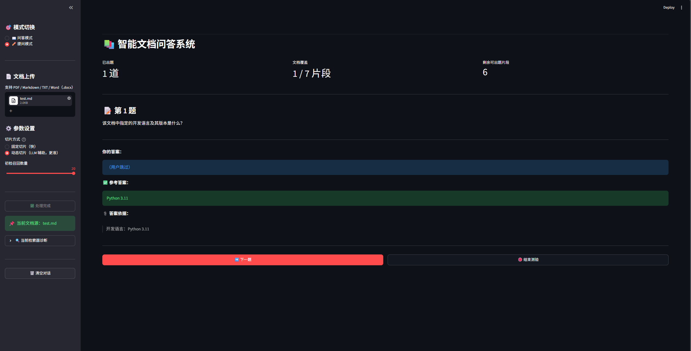

# 📚 RAG 智能文档问答系统

基于 RAG（检索增强生成）的文档学习系统。上传文档后，支持**问答模式**和**提问模式**两种交互：问答模式让用户提问、系统检索回答；提问模式让系统根据文档主动出题、用户凭记忆作答。

## 📸 项目概览

| 问答模式 | 提问模式 |
|---|---|
|  |  |

## ✨ 功能特性

- 📄 支持 PDF / Markdown / TXT / Word(.docx) 上传
- 🔍 混合检索（BM25 关键词 + 向量语义）
- 🎯 CrossEncoder Rerank 精排（bge-reranker-v2-m3）
- 🧠 **LLM 辅助动态切片**（按语义主题切分，而非固定长度）
- 📊 **动态 Top-K**（根据 Rerank 分数自适应决定引用几段）
- 💬 多轮对话（支持指代追问，如"它的定价呢？"）
- 📎 引用来源溯源（显示片段来源和相对相关度）
- 🚫 拒答机制（文档无相关内容时主动拒答）
- ⚡ 流式输出（答案逐字生成）
- ✏️ **提问模式**（系统主动出题 + 用户作答 + 展示参考答案）
- 📈 RAGAS 量化评估 + 消融实验

## 🏗️ 系统架构

```
用户上传文档
    ↓
【预处理阶段】
文档切片（固定切片 / LLM 辅助动态切片）
    ↓
向量化 + 存入 Chroma（每次唯一 collection）
    ↓
【问答模式】
用户提问 → 查询改写 → 混合检索 → Rerank → 动态 Top-K → LLM 流式生成 → 引用来源
    ↓
【提问模式】
系统抽取片段 → LLM 出题（题+答案+依据）→ 用户作答 → 展示参考答案
```

## 🛠️ 技术栈

| 模块 | 方案 | 说明 |
|---|---|---|
| 开发语言 | Python 3.11 | |
| RAG 框架 | LangChain 1.x | |
| 向量数据库 | Chroma | 内存模式，每次上传文档独立隔离 |
| Embedding | BAAI/bge-small-zh-v1.5 | 中文效果好，CPU 可跑 |
| Rerank | BAAI/bge-reranker-v2-m3 | CrossEncoder 精排 |
| 大模型 | DeepSeek Chat | 兼容 OpenAI 接口 |
| 前端 | Streamlit | |
| 文档解析 | PyPDF2 / docx2txt | |
| 评估 | RAGAS | 四维度量化评估 |

## 🚀 快速开始

### 1. 克隆仓库

```bash
git clone https://github.com/slw-cuddlebear/RAG_DocQA.git
cd RAG_DocQA
```

### 2. 创建虚拟环境

```bash
python -m venv .venv

# Windows
.venv\Scripts\activate

# macOS / Linux
source .venv/bin/activate
```

### 3. 安装依赖

```bash
pip install -r requirements.txt
```

### 4. 配置环境变量

复制 `.env.example` 为 `.env`，并填入你的 Key：

```bash
cp .env.example .env
```

然后编辑 `.env`：

```env
DEEPSEEK_API_KEY=sk-你的key
HF_ENDPOINT=https://hf-mirror.com
HF_HUB_DISABLE_SYMLINKS_WARNING=1
```

> DeepSeek API Key 申请地址：https://platform.deepseek.com
> ⚠️ `.env` 包含密钥，已被 `.gitignore` 忽略，请勿提交到仓库。

### 5. 启动应用

```bash
streamlit run app.py
```

浏览器访问 `http://localhost:8501`。

## 📖 使用说明

### 预处理

1. 上传文档（支持 PDF / Markdown / TXT / docx）
2. 选择**切片方式**：
   - **固定切片**：按字数机械切分，速度快
   - **动态切片（LLM 辅助）**：调用 LLM 按语义主题切分，切片更聚焦，需要等待 10~30 秒
3. 调整参数（可选）：初检召回数量等
4. 点击 **「开始预处理」** → 等待处理完成

### 问答模式

在底部输入框提问，系统返回答案 + 引用来源。

### 提问模式

1. 切换到「✏️ 提问模式」
2. 点击「开始提问」，系统自动从文档中抽题
3. 输入答案后点击「提交」，系统展示参考答案和答案依据
4. 可点「下一题」继续，或「结束测验」查看本次历史

### 注意事项

- ❌ 不支持图片型 PDF（扫描件），因为无法提取文字层
- ❌ 不支持旧版 `.doc` 格式，请先另存为 `.docx`
- ✅ 换文档时会清空历史对话，避免旧文档污染新文档

## 📊 评估结果

### RAGAS 主评估（30 道正向问题，动态切片 + Rerank）

| 指标 | 得分 | 说明 |
|---|---|---|
| Faithfulness | **0.9654** | 答案忠于原文，无编造 |
| Answer Relevancy | **0.8920** | 答案与问题高度相关 |
| Context Precision | **0.7565** | 检索结果精确度 |
| Context Recall | **0.8222** | 检索结果召回率 |

### 消融实验（验证 Rerank 价值）

| 指标 | 加 Rerank | 不加 Rerank | 提升 |
|---|---|---|---|
| Faithfulness | **0.9897** | 0.7582 | **+0.23** |
| Answer Relevancy | **0.9028** | 0.5013 | **+0.43** |
| Context Precision | **0.7565** | 0.1611 | **+0.62** |
| Context Recall | **0.8356** | 0.2672 | **+0.59** |

> 在 37 页文档（动态切片后 37 个片段）上，不加 Rerank 时 30 道题有 18 道直接拒答；加 Rerank 后全部正常回答。说明 CrossEncoder 精排是 RAG 系统的必要环节。

### 拒答测试（15 道负向问题）

| 类别 | 正确率 |
|---|---|
| 文档未提及实体 | 5/5 |
| 文档未提及数字 | 5/5 |
| 边缘模糊问题 | 5/5 |
| **总准确率** | **100%** |

> 拒答题涵盖"未提及的实体、未提及的数字、边缘模糊问题"三类，全部正确拒答。

### 评估工具说明

RAGAS 评估使用 DeepSeek 作为裁判，存在同源偏见。RAGAS 通过拆解任务（文本蕴含判断、反向生成问题）降低主观性，但无法完全消除。未来可引入 GPT-4o 或 Qwen 作为独立裁判进行交叉验证。

## 📁 项目结构

```
RAG_DocQA/
├── rag_core.py                # RAG 核心逻辑（模型管理、检索、生成）
├── dynamic_split.py           # LLM 辅助动态切片
├── quiz_core.py               # 提问模式：出题、校验
├── app.py                     # Streamlit 前端
├── eval_rag.py                # RAGAS 评估脚本（支持 --no-rerank）
├── eval_reject.py             # 拒答能力评估脚本
├── requirements.txt           # Python 依赖
├── README.md
├── .env.example               # 环境变量模板
├── .gitignore
│
├── data/                      # 数据文件
│   ├── test.md                # 示例文档（小）
│   ├── bp.docx                # 示例文档（大，37 页）
│   ├── eval_questions.json    # 30 道正向测试题
│   └── reject_questions.json  # 15 道负向测试题
│
├── results/                   # 评估结果
│   ├── eval_result_with_rerank.csv
│   ├── eval_result_no_rerank.csv
│   └── eval_reject_result.csv
│
├── docs/                      # 文档资源
│   ├── img_qa.png             # 问答模式截图
│   └── img_quiz.png           # 提问模式截图
│
├── tests/                     # 测试脚本
│   └── test_dynamic_split.py
│
└── archive/                   # 历史版本
    ├── load_docs.py
    ├── rag_qa.py
    ├── rag_qa_hybrid.py
    └── rag_qa_rerank.py
```

## 🔬 运行评估

```bash
# RAGAS 评估（加 Rerank）
python eval_rag.py

# 消融实验（不加 Rerank）
python eval_rag.py --no-rerank

# 拒答测试
python eval_reject.py
```

## 🎯 已实现 / 待优化

### 已实现

- [x] 多格式文档加载（PDF / MD / TXT / DOCX）
- [x] 文本清洗（去除 LaTeX 标记）
- [x] 固定切片 + LLM 辅助动态切片
- [x] 混合检索（BM25 + 向量）
- [x] CrossEncoder Rerank 精排
- [x] 动态 Top-K（根据分数自适应）
- [x] 多轮对话查询改写
- [x] 拒答机制
- [x] 引用来源溯源
- [x] 流式输出
- [x] 提问模式（主动出题）
- [x] RAGAS 量化评估
- [x] 消融实验
- [x] 拒答专项测试

### 待优化

- [ ] 支持多文档知识库
- [ ] 本地 LLM 部署（Ollama + Qwen，数据不出内网）
- [ ] 基于相似度阈值的拒答机制（而非 Prompt 兜底）
- [ ] 云端部署（Streamlit Cloud / HuggingFace Spaces）
- [ ] 支持表格/图片文档的 OCR 预处理
- [ ] 交叉裁判评估（引入 GPT-4o 或 Qwen）

## 🐛 踩坑与解决

### 1. Chroma 换文档后串库

**现象**：上传文档 A 并提问后，切换到文档 B，检索结果里仍然混着 A 的片段。

**原因**：`Chroma.from_documents()` 默认使用固定的 collection 名 `langchain`。同一进程内多次调用时，Chroma 会复用已有 collection，导致新旧文档的向量混在一起。

**解决**：每次构建向量库时生成唯一的 `collection_name`（基于 uuid），物理隔离不同文档的向量。

### 2. Word 文档中的 LaTeX 标记干扰检索

**现象**：Word 导出的文档中百分数写成 `\\(90\\%\\)`，用户搜"90%"匹配不上，BM25 命中率低。

**原因**：`Docx2txtLoader` 提取的是字面字符串，不会自动转换 LaTeX 标记。

**解决**：切片后增加文本清洗步骤，用正则把 `\\(...\\)` 转成 `...`、`\\%` 转成 `%`。

### 3. 固定切片导致检索粒度不足

**现象**：在 37 页文档上，固定切片产生 134 个碎片化片段，部分片段语义不完整，导致检索召回不准。

**解决**：引入 LLM 辅助动态切片——把文档按语义主题切分，得到 37 个聚焦片段，每个片段对应一个完整主题。

### 4. 扫描件 PDF 与旧版 .doc 无法处理

**现象**：上传扫描版 PDF 后系统"答非所问"，上传 `.doc` 直接报错。

**原因**：扫描件没有文字层，`PyPDFLoader` 提取为空；`.doc` 是二进制格式，`Docx2txtLoader` 不支持。

**解决**：加载后检查文字总量，少于 50 字符时主动报错并提示用户做 OCR；对 `.doc` 后缀给出明确的转换提示。

### 5. RAGAS 与 LangChain 1.x 的兼容性问题

**现象**：`from ragas import evaluate` 直接报 `ModuleNotFoundError: No module named 'langchain_community.chat_models.vertexai'`。

**原因**：RAGAS 0.4.3 硬编码导入了 `langchain-community` 0.4.2 中已移除的 `vertexai` 子模块。

**解决**：在 import ragas 之前，向 `sys.modules` 注册一个空的 `vertexai` 模块作为兼容垫片。同时注意到 RAGAS 的 `answer_relevancy` 默认请求 `n=3`，而 DeepSeek 只支持 `n=1`，通过设置 `strictness = 1` 修复。

### 6. RAGAS 评估的同源偏见

**问题**：用 DeepSeek 生成答案，又用 DeepSeek 当裁判，存在"自己批改自己"的偏见。

**处理**：RAGAS 通过拆解任务（文本蕴含判断、反向生成问题）降低主观性，但无法完全消除。在 README 中主动说明这一局限，并指出未来可引入 GPT-4o 或 Qwen 作为独立裁判交叉验证。

## 📝 开发日志

- **Phase 1 - 基础链路**：环境搭建、文档加载、切片、向量化、Chroma 存储
- **Phase 2 - 检索优化**：混合检索（BM25 + 向量）、CrossEncoder Rerank 精排、拒答机制
- **Phase 3 - 前端交互**：Streamlit 界面、多轮对话查询改写、流式输出
- **Phase 4 - 量化评估**：RAGAS 四指标评估、Rerank 消融实验、拒答专项测试
- **Phase 5 - 切片优化**：LLM 辅助动态切片、动态 Top-K、提问模式
- **Phase 6 - 工程整理**：代码重构（rag_core 模块化）、目录结构整理、README 编写

## 📄 License

MIT

---

如果这个项目对你有帮助，欢迎 Star ⭐